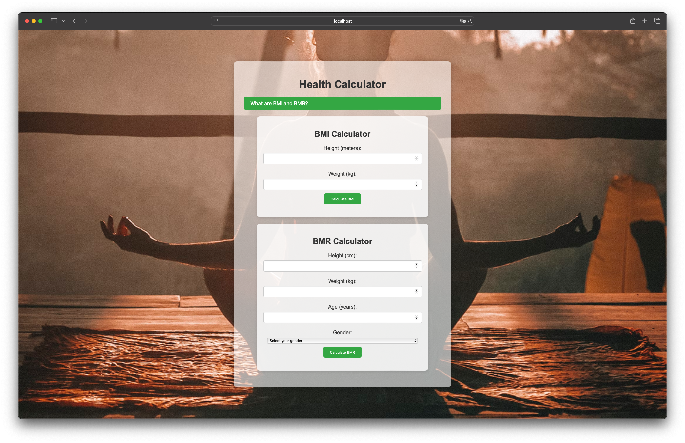

# Health Microservice

A simple Python-based API with a basic frontend that calculates BMI (Body Mass Index) and BMR (Basal Metabolic Rate). This application is built using Flask and provides a web interface for users to interact with.

> [!NOTE]  
> This is a student project and should be considered as such



## Features
- Calculate BMI and BMR using a simple web interface.
- Flask-based backend API.
- Lightweight frontend served via Python's HTTP server.
- Containerized with Docker for easy deployment.
- CI/CD pipeline set up for automatic deployment to Azure Web Apps.

## Prerequisites
Before running the application, ensure you have the following installed:
- Python 3
- Docker (if using containerization)
- Azure account (for deployment)

## Setup and Running the Application Locally

### 1. Clone the Repository
```sh
git clone https://github.com/your-repo/health-microservice.git
cd health-microservice
```

### 2. Set Up Virtual Environment
```sh
make venv
```
This will create a virtual environment and install all necessary dependencies from `requirements.txt`.

### 3. Run the Application
```sh
make run
```
The Flask server will start, and you can access the API.

### 4. Running the Frontend
To serve the frontend on `http://localhost:8000`, run:
```sh
make frontend
```

### 5. Running Tests
```sh
make test
```
This command runs the test suite using `pytest`.

## Running the Application with Docker

### 1. Build the Docker Image
```sh
make docker-build
```

### 2. Run the Docker Container
```sh
make docker-run
```
The application will be available on `http://localhost` (mapped to port 8080 inside the container).

## Deployment
The application is configured for continuous deployment on **Azure Web Apps**. The CI/CD pipeline automatically triggers deployment whenever changes are pushed to the repository.

### Deployment Steps
1. Push code to the repository.
2. The CI/CD pipeline automatically builds and deploys the application to Azure.
3. The application is accessible via the Azure Web App URL.

## Contributing
Feel free to fork this repository and submit pull requests with improvements and fixes.

## License
This project is licensed under the MIT License.